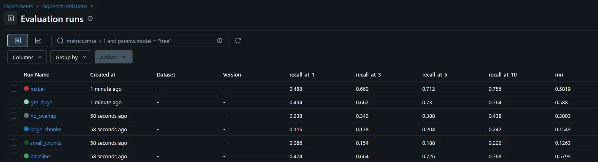
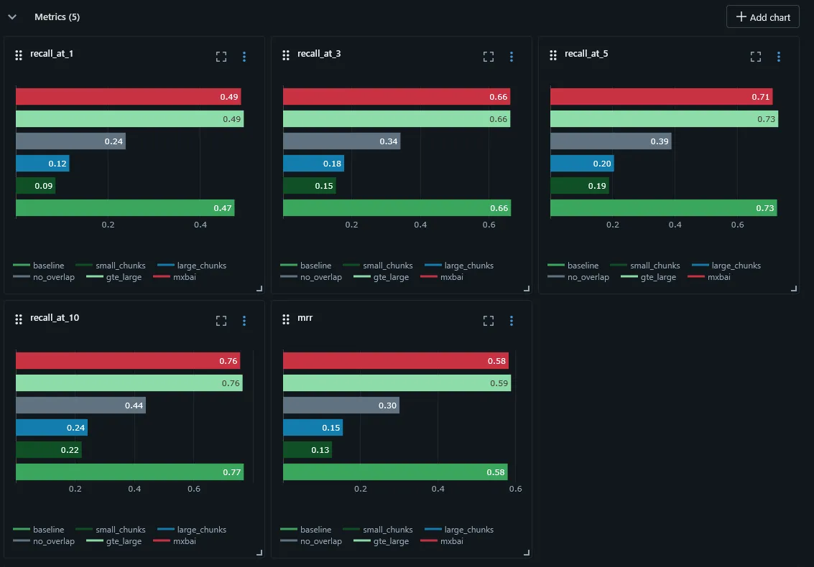
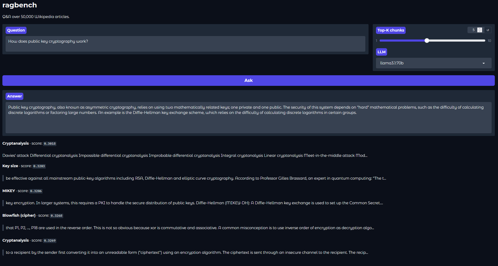

# ragbench

A retrieval-augmented generation (RAG) evaluation framework built using 50,000 Wikipedia articles. The focus is to a RAG pipeline and to systematically measure and emperically improve it. We will evaluate retrieval quality across embedding models, chunk sizes, and overlap configurations using a 500-question synthetic QA dataset generated by `llama3.1:70b`.

All inference is fully local and air-gapped.

---

## Architecture

```
Wikipedia (50K articles)
        ↓
    Ingestion
  (src/ingest.py)
        ↓
    Chunking
  (src/chunk.py)
   256 tokens, 32 overlap
        ↓
    Embedding
  (src/embed.py)
  BAAI/bge-large-en-v1.5
        ↓
    Indexing
  (src/index.py)
  ChromaDB + HNSW
        ↓
   ┌────┴────┐
   │         │
Query     Evaluation
Retrieval  Framework
   │         │
   │    500 synthetic
   │    QA pairs via
   │    llama3.1:70b
   │         │
   ↓         ↓
Ollama   Recall@K
llama3.1:70b  MRR
   │     Faithfulness
   ↓
 Answer
```
 
---

## Results

### Retrieval Metrics (Baseline)

Evaluated over 500 synthetic QA pairs generated by `llama3.1:70b` from randomly sampled chunks.
 
| Metric | Score |
|--------|-------|
| Recall@1 | 0.474 |
| Recall@3 | 0.664 |
| Recall@5 | 0.726 |
| Recall@10 | 0.768 |
| MRR | 0.579 |

### Ablation Results

Systematic evaluation across chunk size, overlap, and embedding model configurations.
 
| Config | Chunk Size | Overlap | Model | Recall@1 | Recall@5 | MRR |
|--------|-----------|---------|-------|----------|----------|-----|
| baseline | 256 | 32 | BGE-large-en-v1.5 | 0.474 | 0.726 | 0.579 |
| small_chunks | 128 | 16 | BGE-large-en-v1.5 | 0.086 | 0.188 | 0.126 |
| large_chunks | 512 | 64 | BGE-large-en-v1.5 | 0.116 | 0.204 | 0.154 |
| no_overlap | 256 | 0 | BGE-large-en-v1.5 | 0.238 | 0.388 | 0.300 |
| gte_large | 256 | 32 | thenlper/gte-large | 0.494 | **0.730** | **0.588** |
| mxbai | 256 | 32 | mxbai-embed-large-v1 | 0.488 | 0.712 | 0.582 |
 

 


### Key Findings
 
**1. Overlap is the most critical chunking parameter.**
Removing overlap (no_overlap) dropped Recall@5 from 0.726 to 0.388 — a 47% relative decrease — larger than any other variable tested. Overlap prevents answers from being split across chunk boundaries, and the impact is dramatic.
 
**2. 256-token chunks outperformed both smaller and larger alternatives.**
Note: chunk size ablations are partially confounded by eval set construction — the 500 QA pairs were generated from 256-token chunks, so chunk IDs from other configurations will not match ground truth even if the correct passage was retrieved. A more rigorous evaluation would generate separate QA sets per chunk configuration.
 
**3. Top-tier open source embedding models perform equivalently on this task.**
BGE-large (0.726), GTE-large (0.730), and mxbai (0.712) are within 2 percentage points of each other on Recall@5. Benchmark rankings (MTEB) do not translate to meaningful real-world differences at this scale and domain. GTE-large wins by a marginal amount.

### Answer Quality Metrics

Evaluated over 100 examples using `llama3.1:70b` for generation and `mistral` as a local judge model.
 
| Metric | Score |
|--------|-------|
| Faithfulness | 0.590 |
| Answer Relevancy | 0.721 |
| Context Recall | 0.500 |
 
Context recall of 0.50 corroborates the retrieval metrics — retrieval is the primary bottleneck, not generation. Improving chunking and embedding will lift all metrics more than improving the LLM.

---

## Demo



---

## Setup
 
### Prerequisites
 
- Python 3.11+
- [Ollama](https://ollama.ai) installed and running
- NVIDIA GPU with 16GB+ VRAM recommended (tested on RTX 5090 32GB)
- CUDA 12.6+ for GPU acceleration
- ~60GB free disk space (models + embeddings + index)
 
### 1. Clone the repo
 
```bash
git clone https://github.com/schuyler-w/ragbench
cd ragbench
```
 
### 2. Create the environment
 
```bash
conda create -n ragbench python=3.11 -y
conda activate ragbench
```
 
### 3. Install PyTorch with CUDA
 
```bash
pip install torch torchvision torchaudio --index-url https://download.pytorch.org/whl/cu128
```
 
### 4. Install dependencies
 
```bash
pip install datasets sentence-transformers chromadb langchain langchain-community ragas rouge-score bert-score gradio pandas numpy tqdm mlflow tiktoken requests
```
 
### 5. Pull Ollama models
 
```bash
ollama pull llama3.1:70b
ollama pull mistral
ollama pull nomic-embed-text
```
 
### 6. Run the pipeline
 
Run each step in order. Each script is idempotent — it will skip if output files already exist.
 
```bash
# Step 1 — Ingest 50,000 Wikipedia articles
python src/ingest.py
 
# Step 2 — Chunk into 256-token segments
python src/chunk.py
 
# Step 3 — Embed with BGE-large (requires GPU, ~20 min)
python src/embed.py
 
# Step 4 — Index into ChromaDB (~5 min)
python src/index.py
```
 
### 7. Run the Gradio UI
 
```bash
python app.py
# Open http://127.0.0.1:7860
```
 
### 8. Run evaluation
 
```bash
# Generate 500 synthetic QA pairs (~90 min with 70B model)
python evals/generate_qa.py
 
# Measure retrieval quality (Recall@K, MRR)
python evals/evaluate_retrieval.py
 
# Measure answer quality (faithfulness, relevancy, context recall)
python evals/evaluate_answers.py
```
 
### 9. Run ablation experiments
 
```bash
# Re-embed and evaluate across 6 configurations (~4-6 hours)
python evals/ablation.py
 
# Log results to MLflow
python evals/log_to_mlflow.py
 
# Open MLflow dashboard
mlflow ui
# Open http://localhost:5000
```
 
---
 
## Project Structure
 
```
ragbench/
├── src/
│   ├── __init__.py
│   ├── ingest.py          # Stream and save Wikipedia articles
│   ├── chunk.py           # Split articles into token-bounded chunks
│   ├── embed.py           # Encode chunks with sentence-transformers
│   ├── index.py           # Load embeddings into ChromaDB
│   └── rag.py             # Retrieval + generation pipeline
├── evals/
│   ├── generate_qa.py     # Generate synthetic QA eval set via LLM
│   ├── evaluate_retrieval.py  # Recall@K and MRR metrics
│   ├── evaluate_answers.py    # Faithfulness, relevancy, context recall
│   ├── ablation.py            # Multi-config ablation runner
│   └── log_to_mlflow.py       # Log ablation results to MLflow
├── data/
│   ├── raw/               # Raw Wikipedia JSONL (not tracked)
│   ├── chunks/            # Chunked text (not tracked)
│   └── embeddings/        # Numpy embedding arrays (not tracked)
├── chroma_db/             # ChromaDB persistent index (not tracked)
├── results/               # Metric JSONs and screenshots
├── app.py                 # Gradio web UI
└── README.md
```
 
---
 
## Hardware
 
Built and tested on:
- Windows 11
- NVIDIA RTX 5090 (32GB VRAM)
- CUDA 13.1
 
Minimum viable setup:
- Any NVIDIA GPU with 8GB+ VRAM for embedding
- 16GB+ system RAM
- Ollama can offload model layers to RAM if VRAM is insufficient — generation will be slower but functional
- CPU-only embedding is possible but will take several hours instead of ~20 minutes
 
---
 
## Methodology Notes
 
**Synthetic QA generation** — ground truth QA pairs are generated by prompting `llama3.1:70b` to write a factual question answerable only by a given chunk. This is a standard technique for evaluating closed-domain retrieval systems when labeled data is unavailable.
 
**Chunk size ablation caveat** — because QA pairs were generated from 256-token chunks, chunk ID-based recall metrics favor the baseline chunking strategy. The correct interpretation is that 256-token chunks with 32-token overlap is the configuration under which this eval set is valid. A production evaluation would generate QA sets independently per configuration.
 
**Local judge model** — answer quality metrics use `mistral` (7B) as a judge model rather than a proprietary API. This keeps evaluation fully air-gapped and reproducible without API costs, at the tradeoff of a less capable judge.
 
---
 
## Stack
 
| Component | Technology |
|-----------|-----------|
| Data | HuggingFace `wikimedia/wikipedia` |
| Chunking | tiktoken `cl100k_base` |
| Embedding | `sentence-transformers` / BGE-large-en-v1.5 |
| Vector DB | ChromaDB (HNSW, cosine similarity) |
| Generation | Ollama `llama3.1:70b` |
| Evaluation judge | Ollama `mistral` |
| UI | Gradio |
| Experiment tracking | MLflow |
 